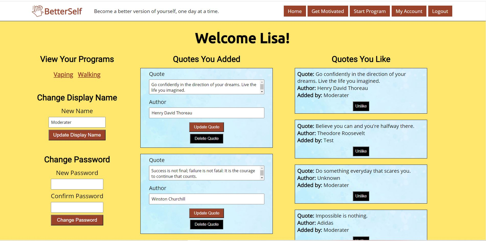
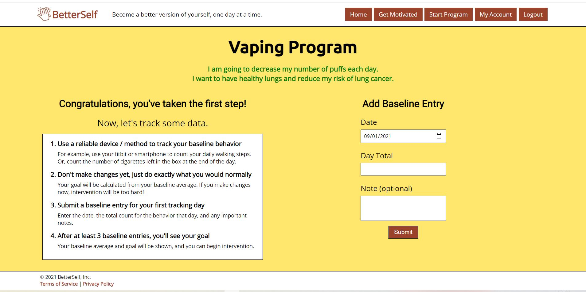
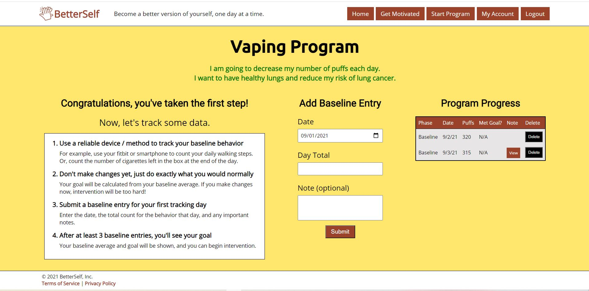
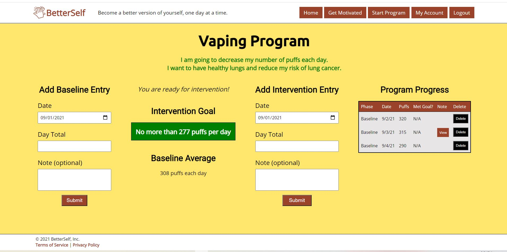

<h1> BetterSelf Web Application</h1>
<h2>Landing page (public view, before login)</h2>

<h2>Motivation wall for logged-in users to add, view, and like quotes</h2>

<h2>Page to begin new behavior change program</h2>

<h2>User account page</h2>

<h2>Specific program page, before data have been added</h2>

<h2>Program page with less than 3 baseline entries</h2>

<h2>Program page with 3 baseline entries </h2>

<h2>Program page with intervention entries</h2>

<h2>Entry note (in new tab)</h2>
